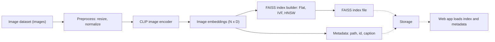

```mermaid
flowchart LR
    A["Image dataset (images)"] --> B["Preprocess: resize, normalize"]
    B --> C["CLIP image encoder"]
    C --> D["Image embeddings (N x D)"]
    D --> E["FAISS index builder: Flat, IVF, HNSW"]
    E --> F["FAISS index file"]
    D --> G["Metadata: path, id, caption"]
    F -.-> H["Storage"]
    G -.-> H
    H -.-> I["Web app loads index and metadata"]

```