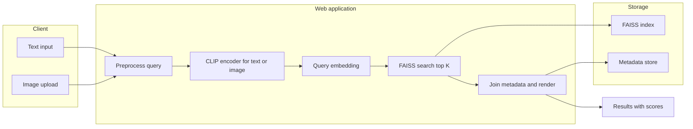

```mermaid
flowchart LR
    subgraph Client
      Q1["Text input"]
      Q2["Image upload"]
    end

    subgraph App["Web application"]
      P1["Preprocess query"]
      E1["CLIP encoder for text or image"]
      QV["Query embedding"]
      S1["FAISS search top K"]
      R1["Join metadata and render"]
    end

    subgraph Storage
      IDX["FAISS index"]
      META["Metadata store"]
    end

    Q1 --> P1 --> E1 --> QV --> S1 --> R1 --> OUT["Results with scores"]
    Q2 --> P1
    S1 --> IDX
    R1 --> META

```