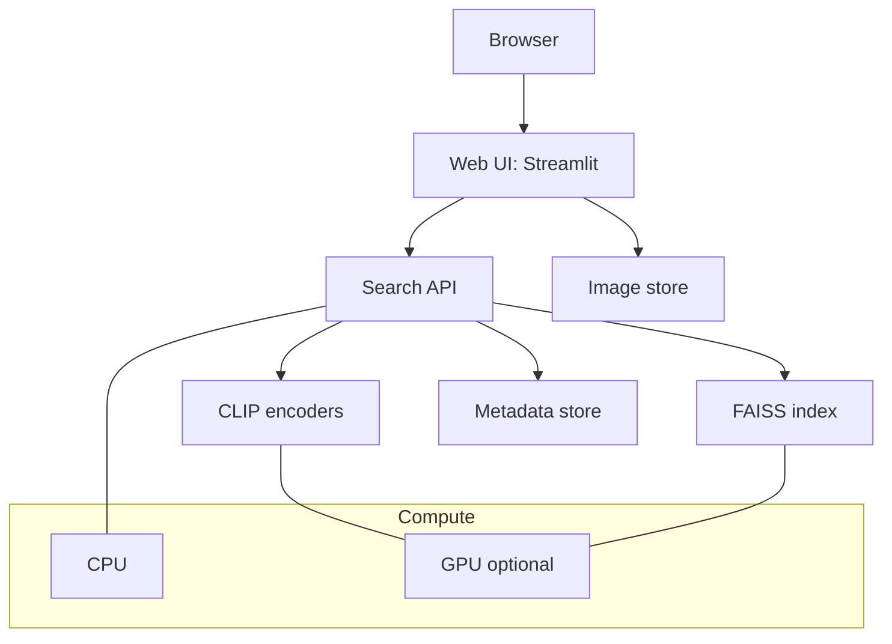

```mermaid
graph TB
    U["Browser"] --> UI["Web UI: Streamlit"]
    UI --> API["Search API"]
    API --> ENC["CLIP encoders"]
    API --> IDX["FAISS index"]
    API --> META["Metadata store"]
    UI --> FS["Image store"]

    subgraph Compute
      CPU["CPU"]
      GPU["GPU optional"]
    end

    ENC --- GPU
    IDX --- GPU
    API --- CPU

```