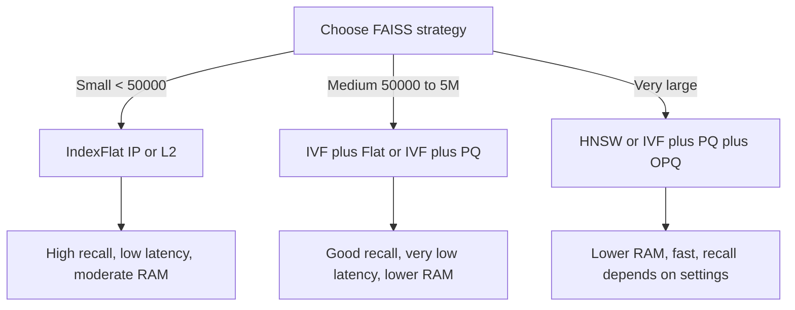

```mermaid
flowchart TD
    A["Choose FAISS strategy"] -->|Small < 50000| B["IndexFlat IP or L2"]
    A -->|Medium 50000 to 5M| C["IVF plus Flat or IVF plus PQ"]
    A -->|Very large| D["HNSW or IVF plus PQ plus OPQ"]
    B --> E["High recall, low latency, moderate RAM"]
    C --> F["Good recall, very low latency, lower RAM"]
    D --> G["Lower RAM, fast, recall depends on settings"]

```