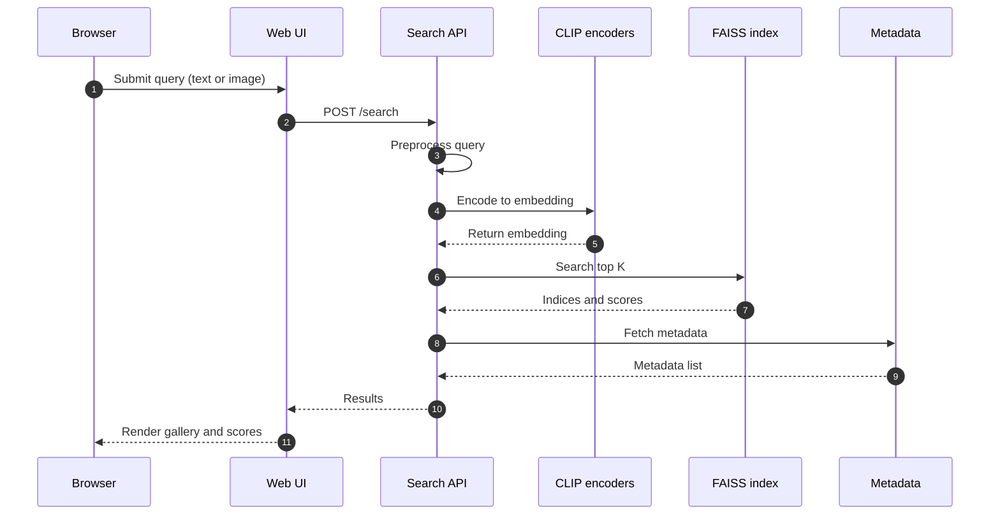

```mermaid
sequenceDiagram
    autonumber
    participant User as Browser
    participant UI as Web UI
    participant API as Search API
    participant ENC as CLIP encoders
    participant IDX as FAISS index
    participant MET as Metadata

    User->>UI: Submit query (text or image)
    UI->>API: POST /search
    API->>API: Preprocess query
    API->>ENC: Encode to embedding
    ENC-->>API: Return embedding
    API->>IDX: Search top K
    IDX-->>API: Indices and scores
    API->>MET: Fetch metadata
    MET-->>API: Metadata list
    API-->>UI: Results
    UI-->>User: Render gallery and scores
    
```
